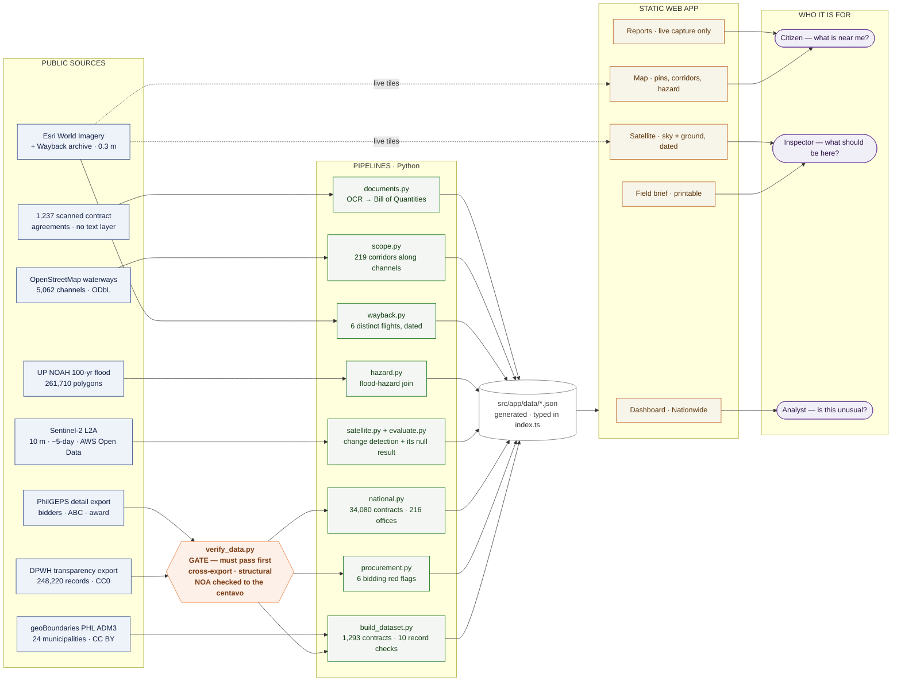
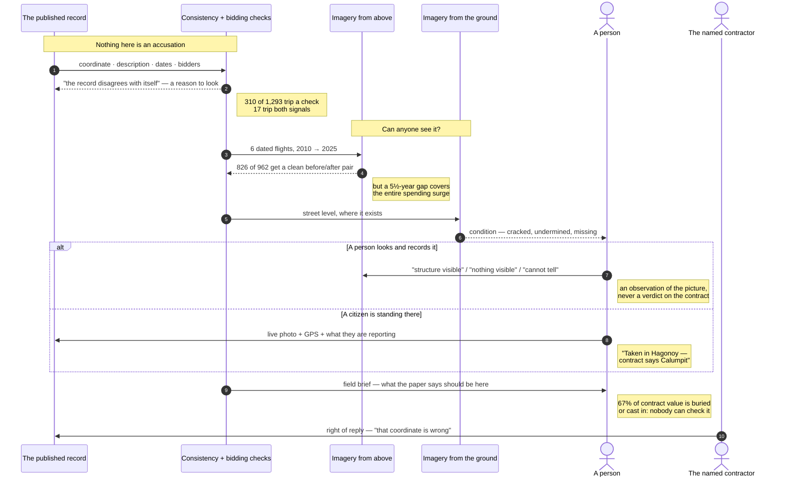

# MASID

Quality monitoring of flood control infrastructure delivery, Bulacan 1st DEO.

A GIS dashboard over **1,293 real DPWH flood control contracts** (2016–2025,
₱67.75 B, 176 contractors), built entirely from public data — no DPWH FOI
response and no PhilSA imagery grant required to run it.

```bash
python3 pipeline/build_dataset.py   # contracts, boundaries, consistency flags
python3 pipeline/verify_data.py     # gate: must pass before anything else runs
python3 pipeline/procurement.py     # bidding red flags, benchmarked nationally
python3 pipeline/satellite.py       # Sentinel-2 change detection (free, no signup)
npm install && npm run dev
```

## Verify before you build

`pipeline/verify_data.py` runs first and gates the rest. It checks that BetterGov's
two exports agree on every shared field, that amounts and the procurement timeline
are internally ordered, that document URLs resolve, and — the check that matters
most — that a published Notice of Award PDF matches its row **to the centavo**.

It exists because this project shipped a tier built on an unchecked assumption
about what a column meant, and a screen built on a claim that turned out to be
false. Both would have been caught by running it.

## What this is

The interface began as a [Figma Make design
export](https://www.figma.com/design/ECH44zAkMxAyLS89wnlWy8/Design-MASID-GIS-Dashboard)
with twelve invented projects. This repo replaces that mock data with the real
public record and adds the derivation that makes it useful: every published
coordinate is reverse-geocoded against official municipal boundaries and compared
with the location the contract description itself states.

**That is a queue to investigate, not a finding.** See [SOURCES.md](SOURCES.md)
for what each check tests, why the thresholds are conservative, and what the
public record does not contain.

## Architecture

Every box below is public data or code in this repo. Nothing is bought, nothing
needs a key, and nothing needs permission — which is the point: a reader can
re-run the whole thing and get the same answer.



**Read it left to right and the design argument falls out.** Everything enters
through one gate, because this project once shipped a tier built on an unchecked
assumption. The pipelines never talk to each other — each emits JSON, and the
fusion happens once, in `index.ts`, where the records score and the procurement
score are crossed. And there is no back end: the app is static files, so it
cannot quietly acquire a server-side judgement nobody can audit.

## How a contract gets checked



The loop never closes on a verdict, and that is deliberate. Each tier hands the
next a **reason to look**, and the only step that can establish whether something
was built is a person standing at the coordinate. The tool's job is to decide
where that person should go first.

## Layout

```
pipeline/verify_data.py     cross-export + structural + primary-source checks — runs first
pipeline/build_dataset.py   fetch → filter → geocode → flag → emit JSON
pipeline/procurement.py     bidders, ABC, timeline, documents, national benchmark
pipeline/national.py        the same indicators for all 216 district offices
pipeline/satellite.py       STAC search → windowed COG reads → composite → z-score
pipeline/evaluate.py        statistic ablation for the imagery tier
pipeline/hazard.py          UP NOAH 100-year flood extent join
pipeline/wayback.py         Esri archive → distinct flights, dated by acquisition
pipeline/scope.py           OSM waterways → per-contract scope corridors
pipeline/documents.py       fetch → rasterise → OCR → Bill of Quantities

src/app/data/               generated JSON, typed by index.ts
src/app/App.tsx             nav + Dashboard, Map, Detail, Documents, Contractors, Admin, Public
src/app/NationwideScreen    216 offices on the same indicators
src/app/SatelliteScreen     imagery review station
src/app/WaybackStrip        the six dated flights
src/app/StreetLevel         ground level, dated (Mapillary)
src/app/GoogleView          keyless Google map + Street View embed
src/app/WhatThePaperSays    Bill of Quantities, split by what can be seen
src/app/ReportsFeed         citizen reports, live capture only
src/app/RightOfReply        a route for a named party to answer
src/app/theme.ts + styles/dark.css   the theme engine
src/app/i18n.ts             English / Filipino
src/app/geo.ts              on-device reverse geocoding

data/                       source cache, untracked (~700 MB with OCR cache)
SOURCES.md                  provenance, licences, gaps, flag definitions
data-docs/                  the data contract, dictionary, methods, limits, quality
data-docs/validate.py       enforces the contract — fails on drift
../FINDINGS.md              what the data said · ../AI-LAYER.md · ../DEMO-SCRIPT.md
```

## Three tiers

**Records tier** — every published coordinate is reverse-geocoded against
official municipal boundaries and compared with the location the contract
description itself states, and every contractor is checked against the
registration marker DPWH publishes in its own records. 310 of 1,293 records
disagree with themselves or with the contractor register in some way.

**Procurement tier** — bidder counts with PCAB ids, the approved budget, the full
procurement timeline and links to published contract documents, all from DPWH's
own detail export at ~100% coverage. Headline finding: this office awards at
**exactly 96.00% of the approved budget on 38.4% of contracts**, against a 4.1%
national flood-control rate — **rank 1 of 43 district offices**, more than double
second place. 57.8% of its bids land on some whole percentage (national 27.0%).
A benchmarked statistical anomaly, not proof of collusion.

**Fusion** — the two signals correlate at **r = +0.05**, so they are genuinely
independent and "high on both" is narrower than either alone. 2×2 triage over all
1,293 contracts: **49 flagged by both**, 109 records-only, 286 procurement-only,
849 neither. An ordering, not a prediction — the ICI never published an itemised
ghost list, so there is no public ground truth to validate a ranking against.

**Imagery tier** — Sentinel-2 L2A change detection over the pre-construction and
post-completion periods, sampled at 30 m, 90 m and 150 m against a bootstrap null
of 160 same-radius discs drawn from each site's own surroundings. Free public COGs
on AWS Open Data via the Earth Search STAC: no account, no API key, no Earth
Engine signup. 200 records assessed, with before/after NDVI chips rendered for
each.

## The imagery tier does not work, and reports that itself

The seeded control sample exists to measure the detector against itself. It
fails: flagged records detect at **5.9%**, seeded controls at **7.7%** — controls
slightly *more* often, Fisher exact p = 1.00. **No individual satellite verdict
carries evidential weight about its contract**, and the app says so in a red
banner above every assessment.

`pipeline/evaluate.py` establishes *why*, rather than assuming it. Four change
statistics — from a plain disc mean to the most-changed 3×3 patch anywhere in the
disc — swept across four thresholds, none reaching usable recall on contracts
that were in the main actually built:

| Statistic | 1.0σ | 1.5σ | 2.0σ | 2.5σ |
|---|---|---|---|---|
| `disc-mean` | 25.6% | 15.4% | 12.8% | 0.0% |
| `tail` | 23.1% | 15.4% | 15.4% | 10.3% |
| `core` | 25.0% | 16.7% | 8.3% | 8.3% |
| `patch` | 20.5% | 20.5% | 10.3% | 7.7% |

This **rules out dilution**, which was the obvious explanation and the one an
earlier draft asserted: concentrating the measurement on the most-changed patch
does not rescue recall. The limit is the sensor and the setting, so the next
lever is resolution (3 m PlanetScope) or different physics (Sentinel-1 SAR
coherence) — not another estimator. See [SOURCES.md](SOURCES.md).

This is a real constraint on the whole approach, and shipping it stated plainly is
worth more than a detector that looks like it works.

**Neither tier establishes that a project was not built.** A flag means the
paperwork disagrees with itself. See [SOURCES.md](SOURCES.md).


## Optional: the dated ground-level viewer

The contract panel can show **street-level captures with a year-by-year
stepper** — the same spot photographed from the road on known dates, which is
the one view that shows whether a structure is cracked or undermined rather
than merely present.

It is off by default and needs a free **Mapillary** client token. **No billing
account is involved.**

```bash
cp .env.example .env.local
# paste your MLY|... token into VITE_MAPILLARY_TOKEN
npm run dev
```

Get the token at <https://www.mapillary.com> → Dashboard → Developers →
Register an application → **Client token**. It is read-only, intended for public
bundles, and cannot spend anything.

**Why not Google Street View?** Two reasons, both fatal on their own. Every
Google Maps Platform key — including the Embed API, whose basic usage is *not*
charged — must sit on a project with **billing enabled**. And Google's "see more
dates" time slider is a feature of the Maps *interface*, exposed by **no API**,
so even a billed key could not rebuild the year-by-year comparison inside this
app. Google Street View is therefore offered as an out-link, where its own
slider does work.

**Coverage will be patchy and that is reported, not hidden.** These sites are
riverbanks; street-level imagery follows roads. Where nothing exists the panel
says so plainly — "no ground photographs of this site" is a finding, and one
that anyone with a phone can fix, since Mapillary accepts contributions.
