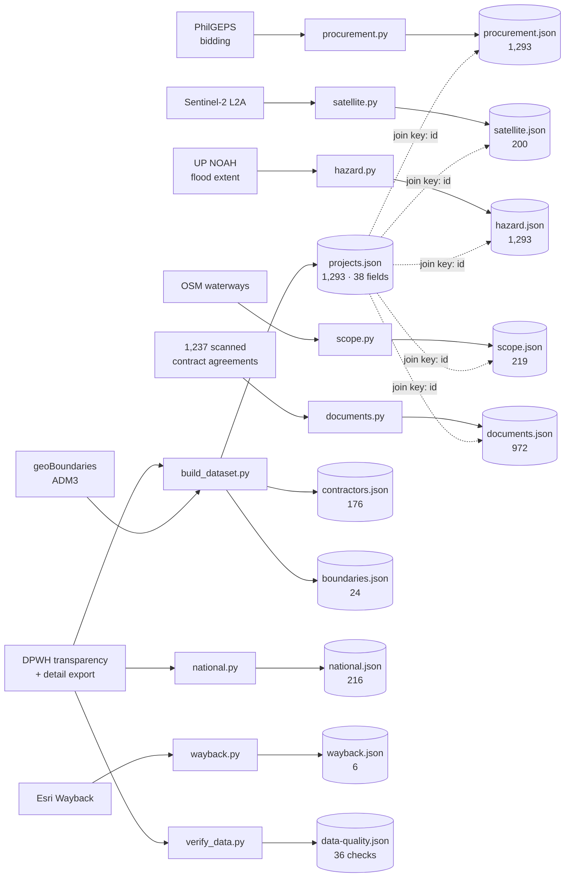

# Lineage — where every field comes from

Two questions this answers, which nothing else in the repo does:

1. *If this source disappeared tomorrow, what breaks?*
2. *Is this number DPWH's, or ours?*

The second is the one a panel asks. **38 of 129 fields are published, 73 are
derived by this project, 18 are joined from third parties** — so more than half
the register as presented is our arithmetic, and it has to be traceable.

---

## Source → pipeline → dataset



`verify_data.py` gates the rest: it runs first and a FAIL stops the build. See
[`QUALITY.md`](QUALITY.md).

---

## If a source disappeared

| source | what breaks | severity |
|---|---|---|
| **DPWH transparency export** | everything. It is the spine — `projects.json`, `contractors.json`, and the join key every other dataset uses. | fatal |
| **PhilGEPS detail export** | all bidding analysis: the 96.00% finding, bidder counts, the national comparison, the procurement half of the triage. Record-side checks survive. | severe |
| **geoBoundaries ADM3** | every coordinate check — `MUNI_MISMATCH`, `OUTSIDE_PROVINCE`, `BOUNDARY_ADJACENT` — plus on-device reverse geocoding in citizen reports. 309 flags become uncomputable. | severe |
| **Sentinel-2** | the change-detection tier, which is already reported as a null result. **Nothing that is relied on is lost.** | low |
| **Esri Wayback** | the dated imagery strip and the finding about the 5½-year gap. Live basemap tiles are a separate dependency. | moderate |
| **UP NOAH** | the hazard join. The register still works; the "is the flood control where the flooding is" question does not. | moderate |
| **OSM waterways** | 219 scope corridors. The dashed-circle fallback remains for contracts with a stated length. | moderate |
| **The scanned PDFs** | the Bill of Quantities tier and the 774 recovered dimensions. | moderate |

## Fields with no source at all

Worth stating plainly, because their absence *is* a finding:

- **disbursement** — `amountPaid` is published but frequently zero. There is no
  source anywhere for what was actually paid.
- **Program of Work** — the document that would carry designed quantities is
  published for **0 of 1,237** contracts.
- **revocation dates** — DPWH publishes the `[REVOKED]` marker but never a date.
- **barangay as an administrative code** — parsed from description text only.
- **ground truth on ghost projects** — the ICI referred its findings rather than
  publishing an itemised list, so **no ranking in this project can be validated
  against a known answer.**

## Reproducing the chain

```bash
cd masid
python3 pipeline/verify_data.py        # GATE — must pass first
python3 pipeline/build_dataset.py      # register, boundaries, record checks
python3 pipeline/procurement.py        # bidding red flags
python3 pipeline/national.py           # 216 offices, same indicators
python3 pipeline/hazard.py             # flood hazard join
python3 pipeline/satellite.py          # Sentinel-2 + its self-validation
python3 pipeline/evaluate.py           # statistic ablation
python3 pipeline/wayback.py            # dated imagery flights
python3 pipeline/scope.py              # corridors from OSM waterways
python3 pipeline/documents.py --all    # OCR the scans (~45 min, cached)

python3 data-docs/validate.py          # contract vs data — must exit 0
python3 data-docs/build_dictionary.py  # regenerate DICTIONARY.md
python3 data-docs/build_quality.py     # regenerate QUALITY.md
```

Order matters only for the gate. Everything after it reads the same inputs and
writes its own file, so any pipeline can be re-run alone.

**Caches:** `data/` holds the source parquets and ~700 MB of OCR cache. It is
untracked and is what makes a re-run fast rather than a re-download.

---

*Field-level definitions: [`DICTIONARY.md`](DICTIONARY.md).
Licences and why each source was chosen: [`../SOURCES.md`](../SOURCES.md).*
